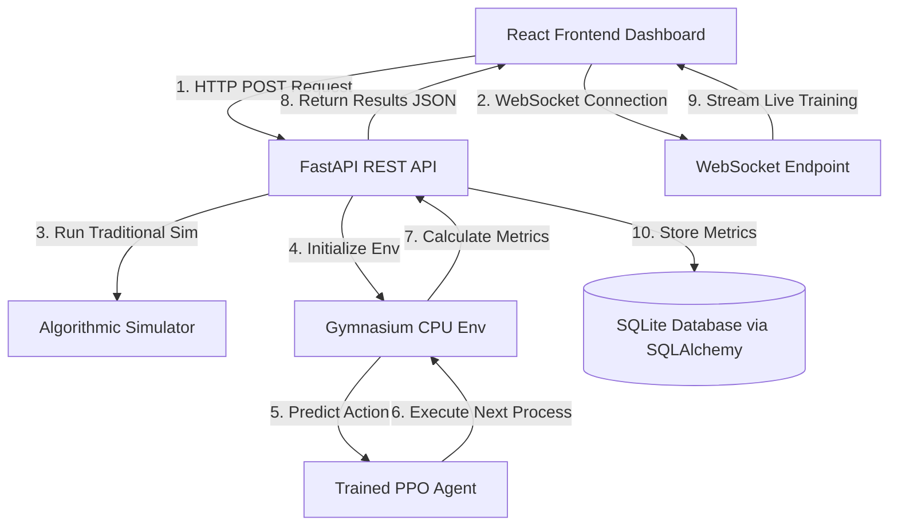

# 🧠 Project Guide: Adaptive Reinforcement Learning CPU Scheduler

Welcome to the ultimate guide for the **Adaptive RL-Based CPU Scheduler**. This document covers the systems architecture, machine learning design, frontend-backend flow, and prep guidelines to help you master this project and confidently answer any questions in reviews or interviews.

---

## 📋 Table of Contents
1. [System Architecture & Data Flow](#1-system-architecture--data-flow)
2. [Traditional Schedulers vs. Reinforcement Learning](#2-traditional-schedulers-vs-reinforcement-learning)
3. [Deep Dive: Reinforcement Learning Design](#3-deep-dive-reinforcement-learning-design)
4. [Tech Stack & Communication Mechanisms](#4-tech-stack--communication-mechanisms)
5. [Key OS & RL Concepts Reference](#5-key-os--rl-concepts-reference)
6. [Interview & Presentation Q&A Preparation](#6-interview--presentation-qa-preparation)
7. [Commands Cheat Sheet](#7-commands-cheat-sheet)

---

## 1. System Architecture & Data Flow

This project is a high-performance, full-stack CPU scheduling simulator. The architecture is split into three main parts: **React Frontend**, **FastAPI Backend**, and the **Gymnasium/Stable-Baselines3 Reinforcement Learning engine**.



### 🔄 The Execution Flow
1. **Workload Definition**: The user configures a process workload on the React dashboard (either auto-generated, custom manual entries, or uploaded via CSV).
2. **Simulation Dispatch**: When clicking "Run", the React app fires a request to `/api/simulate` or `/api/benchmark`.
3. **Execution**:
   - **Algorithmic Schedulers**: Calculated immediately via standard code logic in the backend.
   - **RL Scheduler**: The backend loads the trained policy zip file, instantiates the custom Gymnasium environment `CPUSchedulerEnv`, and loops through the simulation. At each step, the neural network evaluates the ready queue status and returns the next process to execute.
4. **Data Aggregation**: Once the simulation finishes, the backend packages Gantt chart intervals, average wait times, CPU core utilization logs, and context switch counts, returning them to the React frontend.
5. **Real-time Training**: If training is triggered, the backend spins up a training worker in a background thread. Real-time rewards and step progress are pushed directly to the UI using low-latency WebSockets.

---

## 2. Traditional Schedulers vs. Reinforcement Learning

| Scheduler | Type | Selection Criteria | Real-World Analogy |
|-----------|------|--------------------|-------------------|
| **FCFS (First-Come First-Served)** | Non-preemptive | Order of arrival. | Waiting in a grocery queue. |
| **SJF (Shortest Job First)** | Non-preemptive | Shortest burst time. | Express lane checkout (fewest items go first). |
| **SRTF (Shortest Remaining Time First)** | Preemptive | Shortest remaining execution time. | Reading a book, putting it down to answer a quick text message, then returning to the book. |
| **Round Robin (RR)** | Preemptive | Time slice rotation (quantum). | Teacher spending exactly 5 mins per student in a circle. |
| **Priority (with Aging)** | Preemptive/Non-preemptive | Priority score (increases over time). | Boarding passengers on a flight (VIPs first, but economy passengers get bumped up if they wait too long). |
| **Adaptive RL (PPO)** | Preemptive | Neural network dynamic decision. | A experienced human supervisor dispatching tasks based on queue size, remaining work, and task priority. |

---

## 3. Deep Dive: Reinforcement Learning Design

The RL agent learns by interacting with a custom **Gymnasium Environment** (`CPUSchedulerEnv`). This environment models a multi-core CPU ready-queue and processes.

### 👁️ State Space (What the AI Sees)
To make optimal scheduling decisions, the neural network receives a **252-dimensional observation vector** representing:
1. **Process Attributes (up to 50 queue slots)**:
   - Normalized **Remaining Burst Time** (how much work is left).
   - Normalized **Wait Time** (how long it has sat in the queue).
   - **Priority** (integer mapping).
   - **Process Type** (0 for CPU-bound, 1 for I/O-bound).
   - **Slot Validity Flag** (boolean representing if a process is in this slot).
2. **Global CPU Metrics**:
   - Number of active CPU cores.
   - Overall CPU utilization.
   - Elapsed simulation time.

### ⚡ Action Space (What the AI Decides)
- **Discrete(50)**: The action is an integer from `0` to `49`. It represents the index of the slot in the Ready Queue that the agent wants to assign to the next free CPU core.

### 🎯 Reward Function (How the AI Learns)
The agent is trained to maximize a cumulative **composite reward function**:
$$\text{Reward} = - (\alpha \cdot \text{Wait Time}) - (\beta \cdot \text{Starvation}) - (\gamma \cdot \text{Context Switches}) + (\delta \cdot \text{CPU Utilization})$$

* **Wait Time Penalty**: Discourages letting processes sit idle.
* **Starvation Penalty**: Heavily penalizes the agent if the maximum wait time of *any* single process exceeds a threshold. This prevents the agent from ignoring long, low-priority tasks.
* **Context Switch Penalty**: Switching processes incurs a CPU overhead. The agent gets penalized if it changes the running process on a core too frequently without reason.
* **CPU Utilization Reward**: Encourages keeping all CPU cores active.

### 🛡️ Action Masking & Fallback
If the RL agent outputs an index pointing to an empty slot in the queue (an invalid action), the environment executes **Action Masking**: it intercepts the action and defaults to selecting the process that has been waiting the longest. This prevents simulation crashes and helps the neural network learn which actions are valid.

---

## 4. Tech Stack & Communication Mechanisms

### 🛠️ Backend Services
- **FastAPI**: Runs the web server. Since it is built on ASGI and supports Python `async`/`await`, it handles web connections without locking up CPU threads.
- **SQLAlchemy (Async)**: An ORM that maps Python classes to the database. It handles database reads/writes asynchronously, allowing the API to remain responsive.
- **SQLite**: A lightweight SQL database engine that stores workload presets and benchmark results in `data/scheduler.db`.

### 🧠 ML Training Pipeline
- **PyTorch**: Provides the tensor computation and neural network backend.
- **Stable-Baselines3 (SB3)**: Contains the implementation of the **PPO** algorithm.
- **Gymnasium**: The framework defining the state transitions, steps, resets, and reward loops.

### ⚛️ Frontend UI
- **React 18 & Vite**: Built for rapid rendering and instant state updates.
- **Recharts**: Converts simulation data arrays into multi-core Gantt charts and real-time training progress graphs.

---

## 5. Key OS & RL Concepts Reference

### Context Switching
When a CPU switches from running one process to another. The OS must save the current process's register state and load the new process's register state. This takes time and invalidates the CPU cache (cache misses). **RL Agent mitigates this via the Context Switch Penalty.**

### Starvation
A situation where a process is ready to run but waits indefinitely because other processes are repeatedly selected ahead of it. **RL Agent mitigates this via the Starvation Penalty.**

### Aging
A technique used to gradually increase the priority of a process as it spends time waiting in the ready queue. **Implemented in the traditional Priority Scheduler.**

### PPO (Proximal Policy Optimization)
An actor-critic reinforcement learning algorithm. The "Actor" network predicts which process to select, while the "Critic" network estimates the expected return (reward). PPO restricts updating the policy too far from the previous policy version at each step, preventing learning collapse.

---

## 6. Interview & Presentation Q&A Preparation

### Q: Why did you use RL instead of Supervised Learning?
> **Answer**: "Supervised learning requires a massive dataset of 'perfectly scheduled' CPU queues labeled by experts. Finding the absolute optimal schedule for complex, dynamic workloads with random arrivals is an NP-Hard problem. By using Reinforcement Learning, the agent learns by interacting directly with the simulation, exploring actions, and receiving rewards. This allows it to discover unique scheduling rules that adapt to changing workloads without needing human-labeled datasets."

### Q: What is the most challenging part of this project?
> **Answer**: "Designing and tuning the composite reward function. If the context switch penalty was too high, the agent behaved like FCFS and refused to switch tasks. If the starvation penalty was too low, the agent behaved like SJF and ignored long processes. Balancing these coefficients ($\alpha, \beta, \gamma, \delta$) through iteration was the key challenge."

### Q: What does the 'Recent Trend' metric represent on the training page?
> **Answer**: "It measures the slope or rate of change of the episode rewards over the last few training runs. If it's a negative or positive value near `0` (e.g. `-0.4`), it tells us that the agent's performance has flattened out, indicating that the neural network policy has converged on a stable scheduling strategy."

### Q: How does the backend process training concurrently with REST requests?
> **Answer**: "FastAPI executes the API endpoints asynchronously. When the user starts training, the backend spawns a background thread using FastAPI's `BackgroundTasks` to execute the SB3 PPO training loop. Telemetry is streamed to the client using a non-blocking WebSocket, keeping the REST routes fully responsive."

---

## 7. Commands Cheat Sheet

Run all commands from the root directory unless specified:

* **Start the Backend**:
  ```bash
  cd backend
  uvicorn app.main:app --reload
  ```
* **Start the Frontend**:
  ```bash
  cd frontend
  npm run dev
  ```
* **Run Backend Unit Tests**:
  ```bash
  cd backend
  pytest tests/ -v
  ```
* **Train the RL Agent via CLI**:
  ```bash
  cd backend
  python -m rl_agent.train --timesteps 100000 --mode medium --n-envs 2
  ```
* **Monitor Training with TensorBoard**:
  ```bash
  cd backend
  tensorboard --logdir=logs/
  ```
